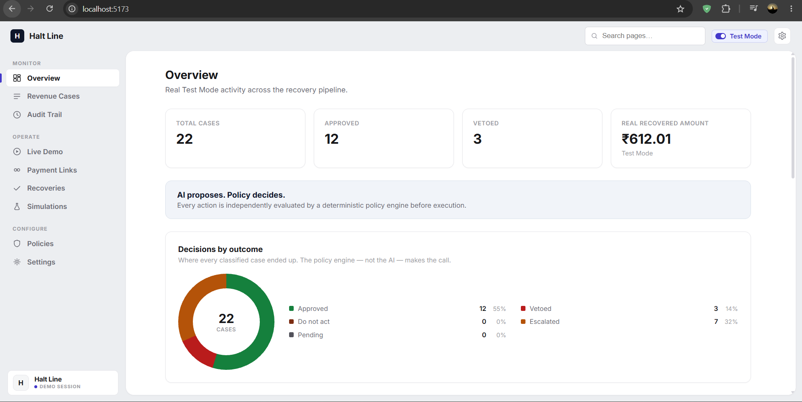
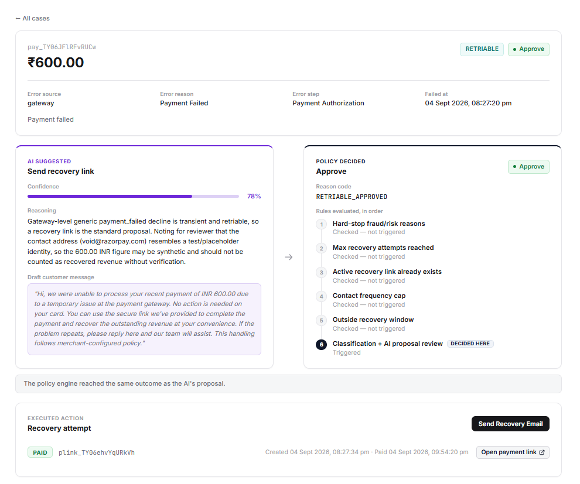
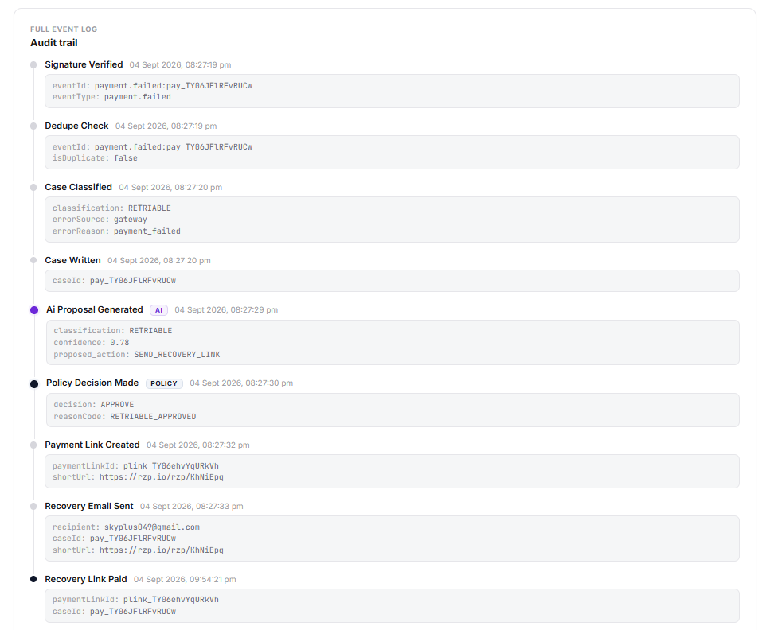
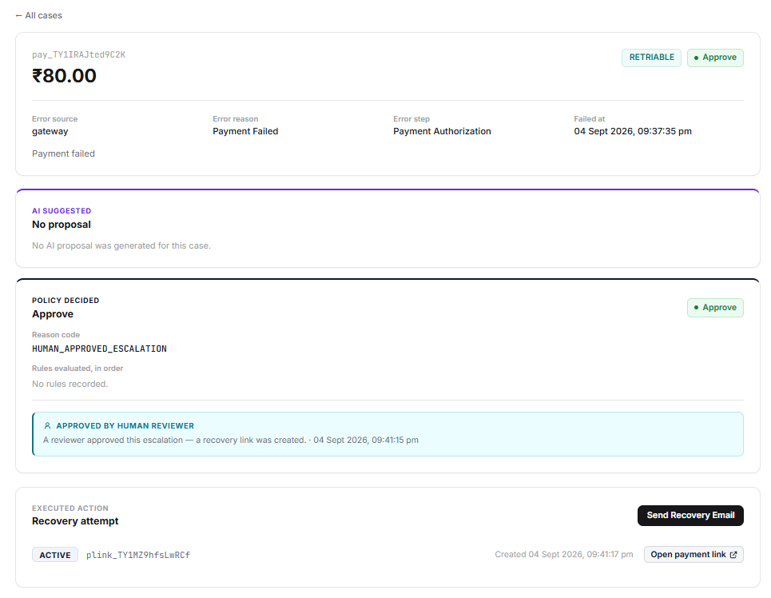
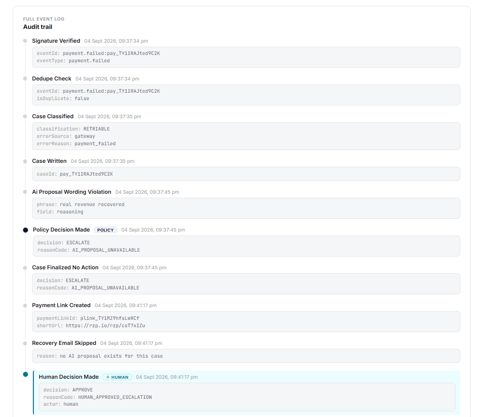
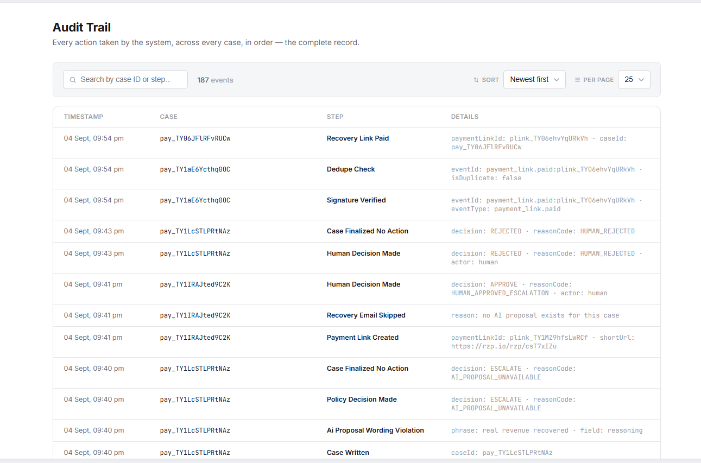

# Halt Line — AI Revenue Recovery Decision Agent

**AI proposes. Policy decides.**

Razorpay merchants lose recoverable revenue when a payment fails for a reason that
would very likely succeed on a second attempt — a gateway soft decline, a timeout,
a temporary bank issue — and there is no systematic, safe follow-up. Halt Line
consumes `payment.failed` webhooks, classifies the failure, asks an LLM to *propose*
one recovery action as structured JSON, and then runs that proposal through a
deterministic policy engine that independently approves, vetoes, or escalates it.
The LLM has no execution authority; only the policy engine can cause a real
Razorpay Payment Link to be created.

For a deeper technical breakdown - data model, design rationale, failure
modes, and the security model - see [ARCHITECTURE.md](docs/ARCHITECTURE.md).

Built for the Razorpay AI Buildathon 2026, Track 03 (AI Revenue Recovery).

- Repo: `https://github.com/VishalGhuge111/HaltLine-AI-Revenue-Recovery-Decision-Agent`
- Current HEAD: `828e5de` (2026-09-04)
- 22 commits on `main`

---

## 1. Architecture — the core loop

`server/src/webhooks/razorpayWebhook.js` is the entry point. Per inbound event:

1. **Signature verify** — HMAC-SHA256 over the raw request bytes
   (`express.raw` is mounted before `express.json` for this path so the body is
   not reparsed), compared with `crypto.timingSafeEqual`. Bad or missing
   signature → HTTP 400, nothing written.
2. **Dedupe** — `checkAndMarkProcessed` runs a Firestore transaction against
   `processed_webhook_events` keyed by a derived event id. A redelivered event
   returns `{ status: 'ok', duplicate: true }` and is not reprocessed.
3. **Classify** — `server/src/services/classifyFailure.js` maps `error_reason`
   (against Razorpay's documented card error reasons) to `RETRIABLE`,
   `NON_RETRIABLE`, or `UNCERTAIN`. `payment_risk_check_failed` →
   `NON_RETRIABLE`; an unspecified `gateway` + `payment_failed` is treated as a
   soft decline → `RETRIABLE`; anything undocumented → `UNCERTAIN`.
4. **AI proposes** — `server/src/ai/proposeRecoveryAction.js` calls
   `anthropic.messages.parse` (model `claude-opus-5`) with a Zod-constrained
   output schema. The model returns `{ classification, confidence,
   proposed_action, reasoning, customer_message }`. `proposed_action` is one of
   `SEND_RECOVERY_LINK`, `NO_ACTION_RECOMMENDED`, `ESCALATE_TO_HUMAN`. A
   code-level validator rejects the proposal if `customer_message`/`reasoning`
   contains a banned phrase (`settle the invoice`, `reactivate the
   subscription`, `RBI`, `NPCI`, `compliant`, `compliance`, `real revenue
   recovered`) or an empty `customer_message`. The proposal carries no
   execution authority.
5. **Policy decides** — `server/src/policy/evaluateProposal.js` makes zero LLM
   calls. It evaluates six rules **in this exact order**, short-circuiting at the
   first one that fires:

   | # | Rule name | Fires when | Decision | reasonCode |
   |---|-----------|-----------|----------|------------|
   | 1 | `HARD_STOP_REASONS` | `errorReason` ∈ `['payment_risk_check_failed']` | `DO_NOT_ACT` | `HARD_STOP_FRAUD_FLAG` |
   | 2 | `MAX_ATTEMPTS` | ≥ 3 prior `recovery_attempts` for the matching order / contact | `VETO` | `MAX_ATTEMPTS_EXCEEDED` |
   | 3 | `ACTIVE_LINK_EXISTS` | an unexpired `active` recovery link already exists for the order / contact | `VETO` | `ACTIVE_LINK_ALREADY_EXISTS` |
   | 4 | `CONTACT_FREQUENCY_CAP` | any `recovery_attempts` row for this contact created in the last 24h | `VETO` | `CONTACT_FREQUENCY_CAP_EXCEEDED` |
   | 5 | `RECOVERY_WINDOW` | the failure is older than 7 days | `DO_NOT_ACT` | `OUTSIDE_RECOVERY_WINDOW` |
   | 6 | `FINAL_CLASSIFICATION` | none of 1–5 fired — decide from classification + AI proposal | `ESCALATE` / `APPROVE` / `VETO` | `UNCERTAIN_OR_AI_ESCALATED` / `RETRIABLE_APPROVED` / `DEFAULT_SAFE_VETO` |

   Rule 6 branches: `UNCERTAIN` classification **or** AI proposed
   `ESCALATE_TO_HUMAN` → `ESCALATE`; `RETRIABLE` **and** AI proposed
   `SEND_RECOVERY_LINK` → `APPROVE`; **everything else** → `DEFAULT_SAFE_VETO`.
   The default is deny. The decision is written to `policy_decisions/{caseId}`
   and a `policy_decision_made` audit event is appended.
6. **Act on APPROVE only** — `server/src/services/executeApprovedRecovery.js`
   creates a real Razorpay Payment Link (48-hour validity), writes a
   `recovery_attempts/{paymentLinkId}` row with `status: 'active'`, and — if
   `autoSendEmail` is enabled in `app_settings` — sends the recovery email via
   Resend. Any other decision writes `case_finalized_no_action` and stops.
7. **Payment confirmation** — a later `payment_link.paid` webhook flips the
   `recovery_attempts` row to `status: 'paid'` and appends `recovery_link_paid`.
8. **Audit trail** — every step is an append-only document in `audit_trail`
   (`server/src/services/auditLog.js`); nothing is ever updated or deleted.






---

## 2. The differentiator — the policy engine vetoes its own AI's proposal

The policy engine and the LLM are separate systems. The engine can, and does,
override the model with zero LLM calls involved in the override.

### A real VETO from current data

Case `pay_TVgvCQOi4YyRfL` (RETRIABLE, ₹5.00, test mode):

- **AI proposal:** `proposed_action: SEND_RECOVERY_LINK`, `confidence: 0.82`.
  The model's reasoning: a gateway-level generic decline on a low-value
  transaction is transient and retry-safe.
- **Policy decision:** `VETO`, `reasonCode: CONTACT_FREQUENCY_CAP_EXCEEDED`
  (rule 4 — a recovery attempt for this contact already existed inside the
  24-hour window). `rulesApplied` records rules 1–4, only rule 4 `triggered`.
- **Effect:** no Payment Link was created. `recoveryAttempts` for this case is
  empty.
- **Audit trail, in order:** `signature_verified` → `dedupe_check` →
  `case_classified` → `case_written` → `ai_proposal_generated`
  (`proposed_action: SEND_RECOVERY_LINK`) → `policy_decision_made`
  (`decision: VETO`) → `case_finalized_no_action`.

Rule 6's `DEFAULT_SAFE_VETO` branch is the same idea at the classification
layer: a `NON_RETRIABLE` case where the model still proposes
`SEND_RECOVERY_LINK` is denied rather than approved (asserted directly in the
policy unit tests; see §3).

### Human-in-the-loop for uncertain cases

For `ESCALATE` decisions the machine is not the last word. Flow:

- AI proposes (often `ESCALATE_TO_HUMAN` itself on low-confidence / `UNCERTAIN`
  cases — e.g. case `pay_TULTX6hZ70Gh7A`, `confidence: 0.62`), **or** the
  classification is `UNCERTAIN`, **or** the AI proposal step itself fails
  (timeout, API error, or the wording-safety validator rejecting the draft —
  see §3/§5), in which case the pipeline escalates with `reasonCode:
  AI_PROPOSAL_UNAVAILABLE` and there is no AI proposal on the case at all.
- Policy engine returns `ESCALATE` and writes `case_finalized_no_action`.
- A human resolves it from the dashboard via
  `POST /api/cases/:caseId/resolve-escalation` with `{ action: "approve" | "reject" }`
  (`server/src/routes/dashboardRoutes.js`):
  - `approve` → runs the *same* `executeApprovedRecovery` path as an automatic
    APPROVE (create link, write `recovery_attempts`, optionally email), rewrites
    `policy_decisions` with `reasonCode: HUMAN_APPROVED_ESCALATION`,
    `resolvedBy: 'human'`, and appends `human_decision_made`.
  - `reject` → decision stays `ESCALATE` but is marked
    `resolutionAction: REJECTED`; appends `human_decision_made` then
    `case_finalized_no_action`.

Two real, currently-existing resolutions from live data:

- **Approved:** case `pay_TY1IRAJted9C2K` (RETRIABLE, ₹80.00) escalated with
  `AI_PROPOSAL_UNAVAILABLE` — the AI's own draft reasoning tripped the wording
  validator (`ai_proposal_wording_violation`, phrase `"real revenue
  recovered"`), so there was no usable proposal on the case. A human clicked
  **Approve & Send Recovery Link**. A real Payment Link
  `plink_TY1MZ9hfsLwRCf` (`https://rzp.io/rzp/csT7xIZu`) was created; because
  there was no AI-drafted message to email, the pipeline logged
  `recovery_email_skipped` ("no AI proposal exists for this case") instead of
  crashing on a null proposal — a bug fixed in `828e5de`. Audit trail ends
  `payment_link_created` → `recovery_email_skipped` → `human_decision_made`
  (`APPROVE` / `HUMAN_APPROVED_ESCALATION`).
- **Rejected:** case `pay_TY1LcSTLPRtNAz` (RETRIABLE, ₹67.00), escalated the
  same way (`AI_PROPOSAL_UNAVAILABLE`). A human clicked **Reject — No Action**.
  No Payment Link, no email. Audit trail ends `human_decision_made`
  (`REJECTED` / `HUMAN_REJECTED`) → `case_finalized_no_action`.

The audit trail UI (`client/src/components/AuditTimeline.jsx`) maps three step
names to three distinct actor badges — `ai_proposal_generated` → **AI**,
`policy_decision_made` → **Policy**, `human_decision_made` → **Human** — each
with its own color token, and human steps additionally get a left border and a
person icon. Both resolutions above are real, and both are visible in the
screenshots below.




---

## 3. Hardening

Four changes made after the core loop worked end-to-end:

1. **AI timeout + fail-safe ESCALATE** — `744a757`
   (`fix: add 15s timeout on AI proposal call; fail-safe to ESCALATE (never
   silent, never auto-approve) if AI proposal fails or times out`).
   `proposeRecoveryAction` races the Anthropic call against a 15s timer. If it
   fails or times out, `runRecoveryPipeline` synthesizes a policy decision of
   `ESCALATE` / `AI_PROPOSAL_UNAVAILABLE` directly — never a silent stop, never
   an auto-APPROVE — so the case still reaches a terminal state.
2. **Single AI attempt** — `b221d03`
   (`fix: disable Anthropic SDK's default automatic retries (maxRetries: 0) to
   guarantee a single AI attempt per case and preserve the 15s timeout budget
   for the ESCALATE fail-safe`). `new Anthropic({ maxRetries: 0 })` in
   `server/src/config/anthropic.js` overrides the SDK default of 2, so a
   transient error fails fast into the fail-safe instead of burning the timeout
   budget on exponential-backoff retries.
3. **Security pass** — `2b43693`
   (`security: gate dev-only test harness behind ENABLE_TEST_HARNESS env flag
   (defaults off); confirm .env and service-account key are gitignored with zero
   secrets in git history`). The Custom Checkout test harness and its static
   mount are only registered when `ENABLE_TEST_HARNESS === 'true'`; unset in a
   real deployment. `server/.env` and `server/firebase-service-account.json` are
   in `.gitignore` and have never been committed
   (`git log --all -- server/.env server/firebase-service-account.json` is
   empty). An earlier change, `76f9289`, also made `/health/firestore`
   read-only (it previously wrote throwaway docs on every hit).
4. **Policy engine unit tests** — `6e0517f`
   (`test: add unit tests for policy engine (9 scenarios covering all 6 rules,
   short-circuit behavior, and rulesApplied shape) via dependency-injected
   Firestore mock; no decision logic changed`). `cd server && npm test`
   currently runs **9 tests, all passing** (Vitest).

---



## 4. Honest metrics

### Real recoveries (Razorpay test mode)

From `GET /api/payment-links` right now:

- 12 recovery links created total: **4 marked `paid`, 8 marked `active`**.
  (Of the 8 active, 5 were created 2026-09-04 and are still within their
  48-hour validity window; the other 3 were created 2026-08-29 and have since
  lapsed — the stored `status` is not retroactively updated on expiry.)
- **Total recovered: ₹612.01** — four paid links: ₹10.00
  (`pay_TVhRUiq8pCtKQ9`), ₹1.00 (`pay_TVhImNXvvWyZ7k`), ₹1.01
  (`pay_TULe8yip4pETin`), and ₹600.00 (`pay_TY06JFlRFvRUCw`). Every one is a
  Razorpay **test-mode** transaction, not real money.

Example end-to-end APPROVE — case `pay_TVhRUiq8pCtKQ9`:
AI proposed `SEND_RECOVERY_LINK` (`confidence: 0.72`) → policy `APPROVE` /
`RETRIABLE_APPROVED` (rules 1–5 evaluated, none triggered; rule 6 decided) →
Payment Link `plink_TVhRlvorm53sqA` (`https://rzp.io/rzp/1vsesBA`) created
2026-08-29T19:24:20Z → recovery email sent → `recovery_link_paid` at
2026-08-29T19:26:33Z.

### Synthetic simulation (not real, clearly separated)

`server/src/simulation/generateSyntheticBatch.js` generates a self-contained
control/treatment batch from **declared** rates — it never reads `revenue_cases`,
`ai_proposals`, or `policy_decisions`, and writes only to
`synthetic_simulations`. Declared assumptions:

| Classification | Share of batch | Control recovery rate | Treatment recovery rate |
|---|---|---|---|
| RETRIABLE | 0.45 | 0.08 | 0.35 |
| NON_RETRIABLE | 0.35 | 0.02 | 0.04 |
| UNCERTAIN | 0.20 | 0.04 | 0.15 |

Most recent stored batch (`sim_1c19b29c-6872-44f9-9f68-f95d0492f140`,
generated 2026-09-03, `n = 300`): control group 154 (6 recovered, ₹12,063.73),
treatment group 146 (38 recovered, ₹1,03,097.41), **simulated incremental
recovery ₹91,033.68**, treatment recovery rate 26.0% vs control 3.9% (+22.1
percentage points). These are outputs of the declared rates above under
`Math.random()`, not measurements.

Methodology disclaimer, reproduced verbatim from
`client/src/pages/Simulations.jsx` (`METHODOLOGY_LINE`):

> Synthetic control/treatment experiment using declared recovery-probability assumptions. Not a live customer A/B test.

---

## 5. What broke and how it was fixed

Before `744a757`, the `catch` block in `runRecoveryPipeline` (when
`proposeRecoveryAction` threw — timeout, API error, wording violation, empty
message) only logged the failure and `return`ed. No `policy_decisions/{caseId}`
document was ever written, so `GET /api/cases` reported `decision: null` for that
case and the dashboard rendered it as **Pending indefinitely** — a terminal-looking
state that was actually just a dropped case, with no human ever prompted.

The fix (`744a757`) makes every AI failure synthesize a real terminal decision
directly: `ESCALATE` / `AI_PROPOSAL_UNAVAILABLE`, plus `policy_decision_made` and
`case_finalized_no_action` audit events — so the case shows up as an escalation a
human can act on, never a silent Pending. The stale pre-fix Pending cases in
Firestore were identified as confirmed artifacts of that bug (not live work) and
removed. As of now, `GET /api/cases` returns 22 cases and **every one has a
terminal policy decision** — 12 `APPROVE`, 7 `ESCALATE`, 3 `VETO`, 0 pending.

---

## 6. At 10,000x scale — known future work, not built

The first thing to break is Firestore read volume in the policy engine. Rules
2–4 each issue unindexed collection scans per case
(`getMatchingRevenueCaseIds`, `countRecoveryAttemptsForCaseIds`,
`findActiveUnexpiredLink`, `findRecentContactAttempt` all call `.get()` on a
`where` query and filter in JS), and `findRecentContactAttempt` in particular
pulls every `recovery_attempts` row for a contact and date-filters in memory. At
volume this needs composite indexes, bounded range queries, and a per-contact
counter/rollup document rather than a scan. Second, the LLM call is one
`claude-opus-5` request per failed payment on the webhook's synchronous path —
cost and tail latency scale linearly and a provider slowdown backs up webhook
processing; this should move to a queue with a cheaper model tier and batching.
Third, `CONTACT_FREQUENCY_CAP` and `ACTIVE_LINK_EXISTS` are read-then-write with
no lock, so two near-simultaneous failures for the same contact can both pass the
check and both send a link — at scale this needs a transaction or an idempotency
key on `(contact, day)`. The audit trail and dashboard queries
(`GET /api/audit-trail` has a flat `.limit(200)`; `GET /api/cases` does an N+1
`policy_decisions` lookup per case) also need pagination and denormalization.

---

## 7. Tech stack, running locally, environment

### Stack

- **Server:** Node.js (tested on v22), Express 5, `firebase-admin` (Firestore),
  `@anthropic-ai/sdk` with Zod structured outputs, `razorpay`, `resend`,
  `dotenv`. Tests: Vitest.
- **Client:** React 19, React Router 7, Vite 8, oxlint. No CSS framework;
  inline styles + CSS custom properties. Read-mostly dashboard
  (Overview, Revenue Cases, Payment Links, Recoveries, Audit Trail, Simulations,
  Policies, Live Demo, Settings).
- **Data:** Firestore collections — `revenue_cases`, `ai_proposals`,
  `policy_decisions`, `recovery_attempts`, `audit_trail`,
  `processed_webhook_events`, `synthetic_simulations`, `app_settings`.

### Prerequisites

- A Firebase project with Firestore; a service-account key JSON saved as
  `server/firebase-service-account.json` (gitignored; loaded by
  `server/src/config/firebase.js`).
- Razorpay test-mode API keys and a webhook secret.
- An Anthropic API key and a Resend API key.

### Environment variables

`server/.env` (gitignored). Complete list, from every `process.env` reference in
`server/src`:

| Variable | Required | Used by |
|---|---|---|
| `ANTHROPIC_API_KEY` | yes (throws at boot if missing) | `config/anthropic.js` |
| `RAZORPAY_KEY_ID` | yes (throws at boot if missing) | `config/razorpay.js`, test harness |
| `RAZORPAY_KEY_SECRET` | yes (throws at boot if missing) | `config/razorpay.js` |
| `RAZORPAY_WEBHOOK_SECRET` | yes (webhook signature verification) | `webhooks/razorpayWebhook.js` |
| `RESEND_API_KEY` | yes (throws at boot if missing) | `config/resend.js` |
| `PORT` | no (defaults to `4000`) | `index.js` |
| `ENABLE_TEST_HARNESS` | no (must equal `'true'` to mount the dev test harness; off otherwise) | `index.js`, `testHarness/testHarnessRouter.js` |

Not an env var but also required at boot: `server/firebase-service-account.json`.

### Run

```bash
# server — http://localhost:4000
cd server
npm install
npm run dev        # nodemon; or `npm start` for plain node
npm test           # Vitest — 9 policy-engine tests

# client — http://localhost:5173 (Vite dev server, proxies /api and
# /test-harness to :4000)
cd client
npm install
npm run dev
npm run build      # vite build — currently clean (320.71 kB JS bundle)
npm run lint       # oxlint — exits 0; 2 non-blocking warnings, 0 errors
```

Package scripts, verbatim: server — `start` (`node src/index.js`),
`dev` (`nodemon src/index.js`), `test` (`vitest run`); client —
`dev` (`vite`), `build` (`vite build`), `lint` (`oxlint`),
`preview` (`vite preview`).

To receive live webhooks locally, expose `:4000` with a tunnel and point a
Razorpay webhook at `<tunnel>/webhooks/razorpay` for `payment.failed` and
`payment_link.paid`, using the same secret as `RAZORPAY_WEBHOOK_SECRET`.
