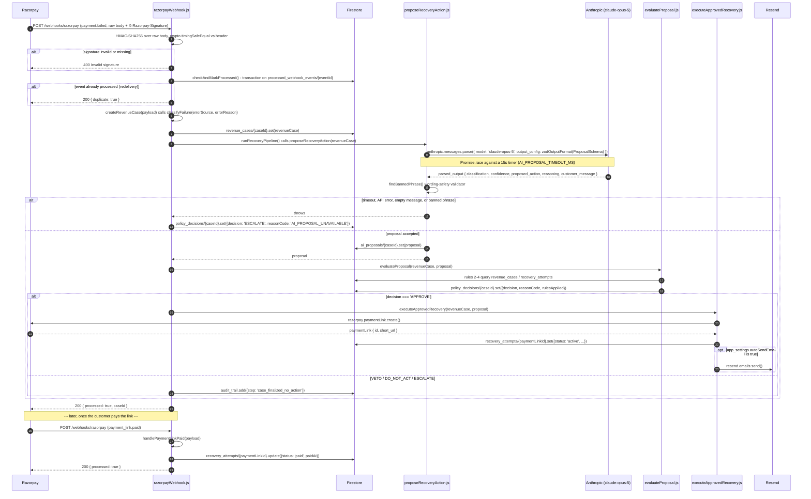

# Architecture

This is the technical companion to [`README.md`](../README.md). The README covers the
pitch, the evidence, and the headline metrics; this document covers how the system is
actually built and why it's built that way, for a reviewer who wants to read the code
against something more detailed than a pitch. Every file path, field name, function
name, and number below was verified against the current repository and live Firestore
data while writing this document — none of it is reconstructed from memory.

---

## 1. System diagram

The full request flow for one `payment.failed` event, through to the eventual
`payment_link.paid` confirmation. Function and file names are exact.



Every numbered step above also appends an event to `audit_trail` via
[`services/auditLog.js`](../server/src/services/auditLog.js) — omitted from the diagram
for legibility; the full list of 19 distinct `step` values is in §2.

---

## 2. Data model

Eight Firestore collections, as they exist in the running database right now (field
shapes below were read directly off live documents, not inferred from the models). No
collection uses subcollections; everything is flat, keyed either by a Razorpay entity id
or an auto id.

### `revenue_cases/{caseId}`

Doc id = the Razorpay payment id (e.g. `pay_TUL1V2EXFhtFJx`). Written once, by
[`models/RevenueCase.js`](../server/src/models/RevenueCase.js)'s `createRevenueCase()`,
persisted from [`webhooks/razorpayWebhook.js`](../server/src/webhooks/razorpayWebhook.js).
Never updated after creation.

| Field | Type | Notes |
|---|---|---|
| `caseId` | string | same value as the doc id |
| `razorpayPaymentId` | string | |
| `razorpayOrderId` | string \| null | |
| `amount` | number | paise (Razorpay's integer minor-unit convention) |
| `currency` | string | |
| `customerContact` | string \| null | |
| `customerEmail` | string \| null | |
| `errorCode` | string \| null | |
| `errorDescription` | string \| null | |
| `errorSource` | string \| null | e.g. `gateway`, `business` |
| `errorReason` | string \| null | Razorpay's documented card error reason |
| `errorStep` | string \| null | |
| `classification` | string | `RETRIABLE` \| `NON_RETRIABLE` \| `UNCERTAIN`, from `classifyFailure()` |
| `createdAt` | Timestamp | `FieldValue.serverTimestamp()` |
| `rawPayload` | object | the entire inbound webhook payload, unmodified |

### `ai_proposals/{caseId}`

Same doc id as `revenue_cases`. Written by
[`ai/proposeRecoveryAction.js`](../server/src/ai/proposeRecoveryAction.js) — only for a
proposal that passed the empty-message and wording-safety checks (see §4). A case that
escalates via `AI_PROPOSAL_UNAVAILABLE` has **no** document here at all.

| Field | Type | Notes |
|---|---|---|
| `caseId` | string | |
| `classification` | string | echoed back from the prompt, not re-derived by the model |
| `confidence` | number | 0–1 |
| `proposed_action` | string | `SEND_RECOVERY_LINK` \| `NO_ACTION_RECOMMENDED` \| `ESCALATE_TO_HUMAN` |
| `reasoning` | string | internal only, never shown to the customer |
| `customer_message` | string | draft text, reviewed by a human before it's ever sent |
| `createdAt` | Timestamp | |

### `policy_decisions/{caseId}`

Same doc id as `revenue_cases`. Written by
[`policy/evaluateProposal.js`](../server/src/policy/evaluateProposal.js) on the automatic
path, or overwritten by
[`routes/dashboardRoutes.js`](../server/src/routes/dashboardRoutes.js)'s
`resolve-escalation` handler on the human path (a `.set()` that spreads the existing
document plus resolution fields, not a partial `.update()`).

| Field | Type | Notes |
|---|---|---|
| `decision` | string | `APPROVE` \| `VETO` \| `DO_NOT_ACT` \| `ESCALATE` |
| `reasonCode` | string | see the code table below |
| `evaluatedAt` | string | ISO 8601 — a plain string, not a Firestore Timestamp |
| `rulesApplied` | array | `{ rule: number, name: string, triggered: boolean }[]`; `[]` for the `AI_PROPOSAL_UNAVAILABLE` fail-safe path |
| `resolvedAt` | string | optional; ISO 8601, only present after a human resolution |
| `resolvedBy` | string | optional; always `'human'` when present |
| `resolutionAction` | string | optional; `'REJECTED'`, set only on the reject path |

`reasonCode` values actually produced by the engine: `HARD_STOP_FRAUD_FLAG`,
`MAX_ATTEMPTS_EXCEEDED`, `ACTIVE_LINK_ALREADY_EXISTS`, `CONTACT_FREQUENCY_CAP_EXCEEDED`,
`OUTSIDE_RECOVERY_WINDOW`, `UNCERTAIN_OR_AI_ESCALATED`, `RETRIABLE_APPROVED`,
`DEFAULT_SAFE_VETO`, plus `AI_PROPOSAL_UNAVAILABLE`, `HUMAN_APPROVED_ESCALATION`, and
`HUMAN_REJECTED` from the fail-safe and human-resolution paths.

Note the type inconsistency: `evaluatedAt`/`resolvedAt` are ISO strings while every other
timestamp field in the schema (`createdAt`, `paidAt`, `receivedAt`, `timestamp`) is a
Firestore `Timestamp`. This is a real, current inconsistency, not a documentation
simplification — `evaluateProposal.js` builds `evaluatedAt` with
`new Date().toISOString()` rather than `FieldValue.serverTimestamp()`.

### `recovery_attempts/{paymentLinkId}`

Doc id is the **Razorpay Payment Link id** (e.g. `plink_TULeSl9X3Jp889`) — not the
`caseId`. Created by
[`services/executeApprovedRecovery.js`](../server/src/services/executeApprovedRecovery.js),
updated in place by `razorpayWebhook.js`'s `handlePaymentLinkPaid()` when the matching
`payment_link.paid` event arrives.

| Field | Type | Notes |
|---|---|---|
| `caseId` | string | foreign key back to `revenue_cases` |
| `customerContact` | string | |
| `razorpayOrderId` | string \| null | |
| `paymentLinkId` | string | duplicated as both the doc id and a field |
| `shortUrl` | string | the `rzp.io/...` link |
| `createdAt` | Timestamp | |
| `expiresAt` | Timestamp | `createdAt` + 48h, computed as `Timestamp.fromMillis(expireBy * 1000)` |
| `paidAt` | Timestamp | present only after the link is paid |
| `status` | string | `'active'` on creation, `'paid'` after confirmation |

There is no `'expired'` status value ever written. Expiry is derived at read time by
comparing `expiresAt` to `now` (policy rule 3 does exactly this in
`findActiveUnexpiredLink()`), which is why the README can observe active-looking links
past their validity window in the raw data — the stored `status` field doesn't change on
expiry, only on payment.

### `audit_trail/{autoId}`

Auto-generated doc id via `.add()`. Written exclusively through
[`services/auditLog.js`](../server/src/services/auditLog.js)'s `logAuditEvent()`, called
from `webhooks/razorpayWebhook.js`, `ai/proposeRecoveryAction.js`,
`policy/evaluateProposal.js`, `services/executeApprovedRecovery.js`,
`services/sendRecoveryEmail.js`, and `routes/dashboardRoutes.js`. Grepping
`server/src` for every call site confirms nothing ever calls `.update()` or `.delete()`
on this collection — it is genuinely append-only, not append-only by convention.

| Field | Type | Notes |
|---|---|---|
| `caseId` | string | |
| `step` | string | event name, see list below |
| `details` | object | free-form, shape varies by step |
| `timestamp` | Timestamp | |

The 19 distinct `step` values that exist in the code today: `signature_verified`,
`dedupe_check`, `case_classified`, `case_written`, `event_received_not_processed`,
`ai_proposal_generated`, `ai_proposal_failed`, `ai_proposal_empty_message`,
`ai_proposal_wording_violation`, `policy_decision_made`, `payment_link_created`,
`payment_link_creation_failed`, `recovery_email_sent`, `recovery_email_failed`,
`recovery_email_skipped`, `case_finalized_no_action`, `human_decision_made`,
`recovery_link_paid`, `payment_link_paid_no_matching_attempt`.

### `processed_webhook_events/{eventId}`

Doc id = the derived event id from `extractEventId()` (the Razorpay payload's `.id` when
present, else `${event}:${entity.id}`, else `${event}:${created_at}` — Razorpay webhook
payloads have no top-level `id` field, which is why this fallback chain exists at all).
Written inside a Firestore transaction in `checkAndMarkProcessed()`, so the
read-exists-check and the write are atomic — a crash mid-pipeline can't cause the same
redelivered event to be silently double-processed.

| Field | Type |
|---|---|
| `eventId` | string |
| `eventType` | string |
| `receivedAt` | Timestamp |

### `synthetic_simulations/{batchId}`

Doc id = `` `sim_${randomUUID()}` ``. Generated by the pure function
[`simulation/generateSyntheticBatch.js`](../server/src/simulation/generateSyntheticBatch.js),
persisted by [`routes/simulationRoutes.js`](../server/src/routes/simulationRoutes.js).
This module reads and writes nothing outside this one collection.

| Field | Type | Notes |
|---|---|---|
| `batchId` | string | |
| `n` | number | batch size, default 300 |
| `generatedAt` | string | ISO 8601 |
| `assumptions` | object | `{ distributionByClassification, controlRecoveryRates, treatmentRecoveryRates }` |
| `cases` | array | every one of the `n` synthetic cases, stored inline: `{ syntheticCaseId, classification, group, amount, recovered }` |
| `summary` | object | `{ controlGroupSize, treatmentGroupSize, controlRecoveredCount, controlRecoveredAmount, treatmentRecoveredCount, treatmentRecoveredAmount, controlRecoveryRateActual, treatmentRecoveryRateActual, simulatedIncrementalRecoveryAmount, simulatedIncrementalRecoveryRate }` |

Storing all `n` cases inline in a single document is a real, low-stakes design choice
worth naming: Firestore caps a document at 1 MiB, which is comfortable at `n = 300` but
wouldn't scale to a much larger synthetic batch without moving `cases` to a subcollection.

### `app_settings/global`

A single fixed doc id, `'global'` — this is not a per-user or per-merchant settings
collection, it's one global config document, consistent with this being a
single-operator system (§7). Read/written by
[`config/settings.js`](../server/src/config/settings.js), exposed via
[`routes/settingsRoutes.js`](../server/src/routes/settingsRoutes.js).

| Field | Type | Notes |
|---|---|---|
| `autoSendEmail` | boolean | gates the auto-send branch in `executeApprovedRecovery` |
| `demoEmailOverride` | string \| null | when set, every recovery email is redirected here regardless of `customerEmail` |
| `updatedAt` | Timestamp | |

`getSettings()` returns in-code defaults (`{ demoEmailOverride: null, autoSendEmail:
false }`) if the document doesn't exist yet, so the collection is optional at boot.

---

## 3. Why these locked decisions

### Payment Links, not a saved-card silent recharge

A silent, no-customer-interaction recharge of a previously failed card payment is not a
mechanism this system could legally build in the Indian card-payments environment: RBI's
Additional Factor of Authentication (AFA) requirement means a domestic card cannot be
debited again without a fresh, customer-present authentication step for a one-off
transaction like this — there's no standing mandate to invoke, because the original
payment already failed. A Razorpay Payment Link is the compliant shape for exactly this
situation: it hands the customer a URL, the customer authenticates the transaction
themselves (OTP/3-D Secure, whatever their bank requires), and the merchant never has to
touch or silently re-charge a stored instrument. This isn't a corner the project cut for
time — it's the correct mechanism given the regulatory environment the code will actually
run in. The system prompt in `proposeRecoveryAction.js` reflects the same awareness from
the other direction: it explicitly forbids the AI from claiming or implying RBI/NPCI
compliance in customer-facing text, because that's a legal claim no LLM output should be
making unsupervised (see §4).

### The AI has zero execution authority

This is enforced, not aspirational. Reading
[`ai/proposeRecoveryAction.js`](../server/src/ai/proposeRecoveryAction.js) end to end: its
only external dependencies are `@anthropic-ai/sdk` (the proposal call itself),
`firebase-admin/firestore` (writing `ai_proposals`), and the internal
`services/auditLog.js`. There is no `require('../config/razorpay')` anywhere in the file,
and no Razorpay client is passed into it. The function's return value — a plain object
matching `ProposalSchema` — is handed to `evaluateProposal()`, and only a decision of
`APPROVE` from that separate module ever reaches `executeApprovedRecovery()`, the one
function in the codebase that calls `razorpay.paymentLink.create()`. The AI cannot create
a Payment Link, cannot send an email, and cannot write anything except its own proposal
document. If the model outright hallucinated `proposed_action: "SEND_RECOVERY_LINK"` on
every case, the worst it could do unilaterally is get vetoed more often — it has no path
to a real side effect on its own.

### A deterministic policy engine between AI and execution

The alternative design — act directly on `aiProposal.proposed_action` — was rejected
because an LLM's output is a proposal with a confidence score, not a guarantee, and this
system moves real money-adjacent actions (creating a real payment link, emailing a
customer). `evaluateProposal.js` runs six rules in a fixed order and short-circuits at the
first one that fires (§1 of the README has the full table); rule 6's `DEFAULT_SAFE_VETO`
branch is the concrete evidence this isn't theoretical: a `NON_RETRIABLE` case where the
AI still proposes `SEND_RECOVERY_LINK` is not approved — it falls through to
`DEFAULT_SAFE_VETO` because the `else` branch of rule 6 is the only path that isn't an
explicit `ESCALATE` or `APPROVE` match. This exact scenario is asserted directly in
`evaluateProposal.test.js` test (c). On live data, the override path that has actually
fired is rule 4 (`CONTACT_FREQUENCY_CAP_EXCEEDED`): all three `VETO` decisions currently
in Firestore (`pay_TULhyDgCMSjpy4`, `pay_TUMYSCKfEDRCfy`, `pay_TVgvCQOi4YyRfL`) carry that
exact `reasonCode`, each with `rulesApplied` showing rules 1–3 evaluated as
`triggered: false` before rule 4 fired — the engine is independently checking
Firestore state the AI never saw, with zero LLM calls involved in making that
determination. `DEFAULT_SAFE_VETO` itself hasn't fired on live data yet in the current
22-case set (`policy_decisions` has zero documents with that `reasonCode` right now) —
worth stating plainly rather than implying it's been observed live when what's actually
been exercised in production so far is a different veto rule with the same
default-deny character.

### Firestore over a relational database

The document-per-case model fits this domain well: a `revenue_case` and everything
derived from it (`ai_proposals/{caseId}`, `policy_decisions/{caseId}`) share the same key
and are read together on every case-detail view, with no multi-table joins needed for the
common path. It also matches the locked stack (`firebase-admin` was chosen from the
start) and gives free serverless hosting, security-rule-free server-side access via the
admin SDK, and a schema that can evolve per-document without a migration step. The honest
tradeoff: the policy engine's rules 2–4 do **live, per-case Firestore queries** rather
than a cached or indexed lookup — `getMatchingRevenueCaseIds()`,
`countRecoveryAttemptsForCaseIds()`, `findActiveUnexpiredLink()`, and
`findRecentContactAttempt()` all issue a fresh `.get()` against Firestore on every single
inbound `payment.failed` event, with several of them filtering results in JS after the
fetch rather than in the query itself (e.g. `findActiveUnexpiredLink`'s expiry check,
`findRecentContactAttempt`'s 24-hour cutoff). This is fine at 22 cases; it is a real,
current architectural cost that a relational database with proper indexes wouldn't
necessarily have avoided either, but that a caching layer specifically would — see §8 for
the concrete mitigation.

### One LLM call per case, not a multi-agent architecture

Every case gets exactly one `anthropic.messages.parse()` call
(`ai/proposeRecoveryAction.js`), producing one structured proposal that the policy engine
either accepts or overrides. There's no chain of specialized agents (a classifier agent, a
drafting agent, a reviewer agent) calling each other. This is a deliberate simplicity
choice with three concrete benefits: the audit trail stays a single, linear
`ai_proposal_generated` event per case instead of a tree of inter-agent calls that would
be harder to reconstruct after the fact; cost and latency stay bounded and predictable
(one call, one 15s timeout budget — see §5) instead of compounding across agent hops; and
it matches the original scope for this build, which explicitly did not call for
multi-agent orchestration. A single well-constrained call with a Zod-enforced output
schema and a code-level wording check (§4) gets the same practical outcome — a
trustworthy structured proposal — with a much smaller surface area to reason about and
secure.

---

## 4. The wording safety validator

Structured-output enforcement (`zodOutputFormat(ProposalSchema)` in
`ai/proposeRecoveryAction.js`) guarantees that the model's response parses into the right
*shape* — a `classification` enum, a `confidence` number in `[0,1]`, a `proposed_action`
enum, and two strings. It says nothing about the *content* of those strings. Zod's
`z.string()` happily accepts an empty string or a string that quotes an unauthorized
regulatory claim. Because of that gap, there is a second, code-level check that runs after
every successful parse, on every case, before a proposal is persisted or acted on:

1. **Empty-message check** (lines 139–145): `customer_message` must be non-blank after
   trimming. A blank draft "is a genuine generation failure (seen in practice on a
   low-confidence case)" per the code's own comment, and is treated as a hard failure —
   `ai_proposal_empty_message` is logged and the function throws, which routes the case
   into the same `AI_PROPOSAL_UNAVAILABLE` fail-safe as a timeout (§5).
2. **Banned-phrase check** (`findBannedPhrase()`, lines 66–77): a case-insensitive
   substring scan of **both** `customer_message` and `reasoning` against
   `BANNED_PHRASES` — `'settle the invoice'`, `'reactivate the subscription'`, `'RBI'`,
   `'NPCI'`, `'compliant'`, `'compliance'`, `'real revenue recovered'`. A hit logs
   `ai_proposal_wording_violation` (with the exact `field` and `phrase` that matched) and
   throws, same fail-safe routing.

This isn't a hypothetical safeguard described for the sake of completeness — it has fired
for real, multiple times, on live Test Mode data. Querying `audit_trail` directly for
`step in ['ai_proposal_wording_violation', 'ai_proposal_empty_message',
'ai_proposal_failed']` against the live database returns exactly four events, all the
same violation, on four different cases:

| Case | Phrase caught | Field | Timestamp |
|---|---|---|---|
| `pay_TY0fcmjGnREVz2` | `real revenue recovered` | `reasoning` | 2026-09-04T15:30:55.075Z |
| `pay_TY0jfr9u2lzCjt` | `real revenue recovered` | `reasoning` | 2026-09-04T15:34:44.164Z |
| `pay_TY1IRAJted9C2K` | `real revenue recovered` | `reasoning` | 2026-09-04T16:07:45.104Z |
| `pay_TY1LcSTLPRtNAz` | `real revenue recovered` | `reasoning` | 2026-09-04T16:10:40.282Z |

All four are the same banned phrase, and all four landed in the internal `reasoning`
field, not the customer-facing `customer_message` — meaning the model was drafting
internal justification that used forbidden language even though that text was never
going to be shown to a customer directly. That's precisely the scenario this second
check exists for: schema validity alone would have let all four proposals through, since
`reasoning` is just `z.string()`. In each case the wording violation meant no
`ai_proposals` document was ever written, and the case escalated to a human with
`reasonCode: AI_PROPOSAL_UNAVAILABLE` — two of those four (`pay_TY1IRAJted9C2K` and
`pay_TY1LcSTLPRtNAz`) are the same two human-resolution examples the README walks through
in §2. No live-data hit for the `'compliant'`/`'compliance'`/`RBI`/`NPCI` phrases exists
in the current database — worth stating plainly rather than implying every banned phrase
has been observed firing, when in the data that currently exists only one has.

---

## 5. Failure modes and recovery

### The 15-second timeout

`ai/proposeRecoveryAction.js` wraps the Anthropic call in `withTimeout()` (lines 18–24):

```js
function withTimeout(promise, ms) {
  let timer;
  const timeout = new Promise((_resolve, reject) => {
    timer = setTimeout(() => reject(new Error(`AI proposal timed out after ${ms}ms`)), ms);
  });
  return Promise.race([promise, timeout]).finally(() => clearTimeout(timer));
}
```

`AI_PROPOSAL_TIMEOUT_MS` is 15000. This is a `Promise.race`, not a request abort: if the
Anthropic call eventually resolves after the 15s timer has already rejected, that late
result is simply never awaited by anything — nothing crashes, the response is just
discarded, and the case has already moved on to the fail-safe path. The comment in the
code states the empirical basis for the 15s figure directly: "LLM calls in this codebase
have taken up to ~10s in real testing," so 15s is headroom above the observed worst case,
not an arbitrary round number.

### The fail-safe decision object

When `proposeRecoveryAction()` throws for any reason — timeout, Anthropic API error, the
empty-message check, or the wording-safety check — `runRecoveryPipeline()` in
`webhooks/razorpayWebhook.js` (lines 62–89) catches it and synthesizes a terminal decision
directly, bypassing `evaluateProposal.js` entirely (there's no AI proposal to evaluate):

```js
const failSafeDecision = {
  decision: 'ESCALATE',
  reasonCode: 'AI_PROPOSAL_UNAVAILABLE',
  evaluatedAt: new Date().toISOString(),
  rulesApplied: [],
};
```

This is written straight to `policy_decisions/{caseId}`, followed by a
`policy_decision_made` and then a `case_finalized_no_action` audit event. The decision is
hardcoded to `ESCALATE` — never a silent drop, and never an auto-`APPROVE` — which is the
property that matters here: an AI outage degrades the system to "a human has to look at
this," not to "nothing happens" (the bug this fixed, see README §5) and not to "act
anyway without a proposal to check" (which would have created a Payment Link with no
policy rules 2–4 having been meaningfully informed by a real AI proposal in the first
place, since rules 2–4 don't consult the proposal at all, but rule 6 does, and rule 6 is
skipped by this bypass).

### Why `maxRetries: 0`

`config/anthropic.js` constructs the client with `new Anthropic({ maxRetries: 0 })`,
overriding the SDK's own default of 2 automatic retries with exponential backoff. The
reasoning is a direct interaction with the 15s timeout budget above: if the SDK were
retrying transparently underneath `withTimeout()`, a single "logical" call to
`proposeRecoveryAction()` could actually be the SDK silently making up to three HTTP
attempts internally (one plus two retries), with backoff delay between them, all counted
against the same 15-second race. That both makes failures slower to surface (multiple
attempts before the code ever sees an error) and makes the 15s timeout less meaningful as
a bound on a single real attempt's latency — it becomes a bound on however many attempts
the SDK managed to fit in 15s, which is non-deterministic. With `maxRetries: 0`, exactly
one HTTP attempt happens per case: a transient error (429, 5xx, connection error) surfaces
immediately as a thrown error, which routes straight into the fail-safe `ESCALATE` path
above rather than into a multi-second retry sequence first. The tradeoff being made
explicitly here: a single transient blip that a default-retrying client might have
recovered from transparently instead escalates a case to a human — judged to be the
correct choice for a payment-recovery system where the fail-safe (human review) is cheap
and safe, and where predictable timeout behavior mattered more than maximizing automatic
AI success rate on flaky-network edge cases.

---

## 6. Testing strategy

### What is unit tested

`server/src/policy/evaluateProposal.test.js`, run via `cd server && npm test` (Vitest).
Nine tests, all passing, covering the policy engine specifically — the one component of
the pipeline that makes zero external calls and is thus the one component where a fully
deterministic, dependency-injected test (`evaluateProposal(revenueCase, aiProposal, {
db, logAuditEvent })` — both collaborators are injectable) is straightforward to write:

| Test | Covers |
|---|---|
| (a) | `VETO` / `CONTACT_FREQUENCY_CAP_EXCEEDED` when the same contact was attempted within 24h, with an *expired* link present to confirm rule 3 correctly does not also fire |
| (b) | `VETO` / `MAX_ATTEMPTS_EXCEEDED` when 3+ prior `recovery_attempts` exist for the matching order, short-circuiting at rule 2 |
| (c) | `VETO` / `DEFAULT_SAFE_VETO` when the AI proposes `SEND_RECOVERY_LINK` on a `NON_RETRIABLE` case — the override-the-AI branch cited in §3 |
| (d1) | `DO_NOT_ACT` / `HARD_STOP_FRAUD_FLAG` on `payment_risk_check_failed`, short-circuiting immediately after rule 1 (only one entry in `rulesApplied`), plus asserting the exact `policy_decisions` write and `logAuditEvent` call args |
| (d2) | `DO_NOT_ACT` / `OUTSIDE_RECOVERY_WINDOW` when the failure is 8 days old |
| (d3) | `APPROVE` / `RETRIABLE_APPROVED` on the clean path — all six rules evaluated, none triggered except rule 6 — plus asserting the exact write/audit-call shape |
| (d4) | `ESCALATE` / `UNCERTAIN_OR_AI_ESCALATED` driven by `classification: 'UNCERTAIN'` alone (AI did not itself propose escalation) |
| (d4b) | `ESCALATE` / `UNCERTAIN_OR_AI_ESCALATED` driven by the AI proposing `ESCALATE_TO_HUMAN` on an otherwise `RETRIABLE` case |
| (final) | every decision's `evaluatedAt` matches the ISO 8601 format the engine is expected to produce |

The test file's own fake Firestore (`createFakeDb()`) implements just the query surface
the engine actually calls — `collection().where().where().get()` returning `{ docs,
size }`, and `collection().doc().set()` — rather than mocking `firebase-admin` wholesale.

### What is not unit tested, and why

The AI proposal layer (`ai/proposeRecoveryAction.js`), the webhook handler itself
(`webhooks/razorpayWebhook.js`), and the entire frontend (`client/src/`) have no
automated test coverage. This isn't an oversight left undocumented — it's a real gap,
named here directly rather than implied to not exist. The AI layer makes a live call to
the Anthropic API and would need either a mocked SDK client or recorded fixtures to test
deterministically, neither of which exists yet. The webhook handler's real behavior —
signature verification against a real HMAC, Firestore transaction semantics for dedupe,
the full pipeline orchestration — was instead validated through extensive live Test Mode
runs against the actual Razorpay and Firestore APIs: the 22 real cases and 12 real
Payment Links referenced throughout this document and the README (e.g. `pay_TVgvCQOi4YyRfL`'s
real `CONTACT_FREQUENCY_CAP_EXCEEDED` veto, `pay_TVhRUiq8pCtKQ9`'s full APPROVE → link
created → paid lifecycle, the four wording-violation catches in §4) are that evidence —
real system behavior under real conditions, not simulated. The tradeoff is explicit: this
gives strong confidence that the system works end-to-end as observed, but no regression
safety net if a future change to the webhook handler or the AI layer breaks something
that particular manual testing session happened to exercise. Naming this gap is itself
meant as a credibility signal rather than something to gloss over — a system that claims
full test coverage it doesn't have is a worse sign than one that's specific about exactly
where its confidence comes from.

---

## 7. Security model

**Webhook signature verification.** `webhooks/razorpayWebhook.js` computes
`crypto.createHmac('sha256', RAZORPAY_WEBHOOK_SECRET).update(rawBody).digest('hex')` over
the raw request bytes and compares it to the `x-razorpay-signature` header using
`crypto.timingSafeEqual()` — a real constant-time comparison, not `===`. Because
`timingSafeEqual` throws if the two buffers differ in length, the code checks
`expectedBuffer.length !== receivedBuffer.length` first and short-circuits to a 400
before ever calling it, so a garbage or truncated signature header can't crash the
handler. `express.raw({ type: '*/*' })` is mounted on `/webhooks/razorpay` ahead of the
global `express.json()` specifically so the signature is computed over the exact bytes
Razorpay sent, not a re-serialized version of a parsed body.

**Clean secret history.** `server/.env` and `server/firebase-service-account.json` are
both in `.gitignore`. Independently confirmed for this document:
`git log --all --oneline -- server/.env server/firebase-service-account.json` returns
nothing — neither file has ever been committed, on any branch, at any point in this
repository's history.

**Test harness gating.** `server/src/testHarness/testHarnessRouter.js` (real Razorpay
Orders API + Custom Checkout order creation, used only to generate realistic test
failures with specific `error_reason` values that Payment Links checkout can't produce)
and its static file mount are registered in `index.js` only inside
`if (process.env.ENABLE_TEST_HARNESS === 'true')`. The flag is off by default — unset in
`.env` means the block never executes, so in a real deployment the endpoint and static
file serving for the harness don't exist at all, not merely "exist but are unused."

**What is explicitly not implemented.** Named directly rather than left for a reviewer to
discover:

- No rate limiting on `POST /webhooks/razorpay` — nothing in `server/src` or
  `package.json` implements request throttling; a burst of requests (legitimate or not)
  is processed as fast as Express and Firestore allow.
- No authentication on any `/api/*` dashboard route — `dashboardRoutes.js`,
  `settingsRoutes.js`, and `simulationRoutes.js` have no auth middleware; anyone who can
  reach the server can read every case, every audit event, and can call
  `POST /cases/:caseId/resolve-escalation` or `PUT /settings`.
- `app.use(cors())` in `index.js` is called with no options, which allows any origin.
- The Firestore service-account key is loaded from a local JSON file
  (`config/firebase.js`) rather than a managed secret store.

This is a real, known gap, not something outside the project's stated scope: this is a
single-operator demo system built for a buildathon submission, not a multi-tenant
production service, and the security posture reflects that honestly rather than
pretending multi-tenant-grade access control was out of scope from the start.

---

## 8. At-scale considerations

Expanding on the README's summary with the specific code paths and specific mitigation
directions, not just "this would need to scale":

| Bottleneck | Where | Concrete mitigation |
|---|---|---|
| Policy rules 2–4 issue a live, unindexed Firestore query per case, and `findRecentContactAttempt` fetches every `recovery_attempts` row for a contact and filters by date in JS | `policy/evaluateProposal.js`: `getMatchingRevenueCaseIds`, `countRecoveryAttemptsForCaseIds`, `findActiveUnexpiredLink`, `findRecentContactAttempt` | Composite indexes on `(customerContact, status)` / `(razorpayOrderId, status)`; replace the full-scan-then-filter-in-JS pattern with a bounded `where('createdAt', '>', cutoff)` range query; maintain a per-contact rollup doc (`lastAttemptAt`, `attemptCount`) written transactionally by `executeApprovedRecovery`, turning rules 2 and 4 into single-document reads |
| One synchronous `claude-opus-5` call per failed payment, on the webhook's request path | `ai/proposeRecoveryAction.js`, invoked from `runRecoveryPipeline()` inline in `router.post('/')` | Move the AI-propose → policy-decide → execute chain off the webhook's synchronous path onto a queue (e.g. Cloud Tasks), so the 200 to Razorpay is returned right after dedupe + case write; route routine `RETRIABLE` cases to a cheaper/faster model tier and reserve the full model for genuinely `UNCERTAIN` cases; batch multiple pending proposals into fewer API calls where latency allows |
| Rules 3 (`ACTIVE_LINK_EXISTS`) and 4 (`CONTACT_FREQUENCY_CAP`) are read-then-write with no lock between the policy check and the later `executeApprovedRecovery` write | `policy/evaluateProposal.js` rules 3–4 + `services/executeApprovedRecovery.js` | Wrap the check-and-create sequence in a Firestore transaction keyed on `(customerContact, day)` or `(razorpayOrderId)` — the same pattern this codebase already uses for webhook dedupe in `checkAndMarkProcessed()` |
| No queue or backpressure on webhook ingestion — a burst of `payment.failed` events all run the full pipeline synchronously, one request at a time, inline in the handler | `webhooks/razorpayWebhook.js` `router.post('/')` | Same queue-based decoupling as above: acknowledge Razorpay immediately, hand the AI/policy/execute chain to a background worker so response latency doesn't depend on Anthropic or Razorpay round-trip time under load |
| `GET /api/cases` and `GET /api/payment-links` each do an N+1 Firestore read per row | `routes/dashboardRoutes.js`: `/cases` calls `policy_decisions.doc(id).get()` per case in a `Promise.all` map; `/payment-links` calls `revenue_cases.doc(caseId).get()` per link | Denormalize the fields actually needed for the list view (`decision`, `reasonCode`, `amount`, `currency`) onto the parent document at write time — the policy engine already has `caseId` when it writes `policy_decisions`, and `executeApprovedRecovery` already has the case's `amount` when it writes `recovery_attempts` |
| `GET /api/audit-trail` uses a flat `.limit(200)` with no pagination | `routes/dashboardRoutes.js` | Cursor-based pagination (`orderBy` + `startAfter`) instead of a fixed cap |

---

## 9. Repository map

```
server/src/
├── ai/                    proposeRecoveryAction.js — the single LLM call, Zod schema,
│                          and the code-level wording-safety validator (§4)
├── config/                env-gated singleton clients: anthropic.js, firebase.js,
│                          razorpay.js, resend.js — plus settings.js (app_settings
│                          get/update helpers)
├── models/                RevenueCase.js — normalizes a raw webhook payload into the
│                          revenue_cases document shape, calling classifyFailure()
├── policy/                evaluateProposal.js — the 6-rule deterministic policy engine
│                          (§3) — and its unit test suite (§6)
├── routes/                dashboardRoutes.js, settingsRoutes.js, simulationRoutes.js —
│                          the REST surface consumed by the React dashboard
├── services/              auditLog.js, classifyFailure.js, executeApprovedRecovery.js,
│                          sendRecoveryEmail.js — shared logic called from both the
│                          webhook pipeline and the dashboard's manual-resolution routes
├── simulation/            generateSyntheticBatch.js — the isolated synthetic
│                          control/treatment generator (README §4)
├── testHarness/           testHarnessRouter.js — dev-only Custom Checkout order
│                          creator, mounted only when ENABLE_TEST_HARNESS=true; not
│                          part of the product's core loop
├── webhooks/              razorpayWebhook.js — the entry point: signature verify,
│                          dedupe, classify, orchestrate the AI→policy→execute pipeline
└── index.js               Express app wiring: middleware order, health checks, route
                           mounting

client/src/
├── components/            presentational building blocks: AuditTimeline, ConfidenceMeter,
│                          DonutChart, GlobalSearch, HumanReview, ListControls,
│                          PageHeader, Panel, RulesChecklist, Sidebar, Skeleton,
│                          StatusBadge, TopBar, ExternalLink
├── hooks/                 useListView.js — shared search/sort/paginate logic used by
│                          every list page
├── pages/                 one file per sidebar route: Overview, CaseList, CaseDetail,
│                          PaymentLinks, Recoveries, AuditTrailPage, Simulations,
│                          Policies, LiveDemo, Settings
├── api.js                 fetch wrapper + one exported function per dashboard endpoint
├── App.jsx                router root
├── format.js               display-formatting helpers (currency, dates, etc.)
├── nav.js                  single source of truth for sidebar structure (also drives
│                          GlobalSearch's page list)
└── pageStyle.js             shared inline style tokens (no CSS framework in this project)
```
